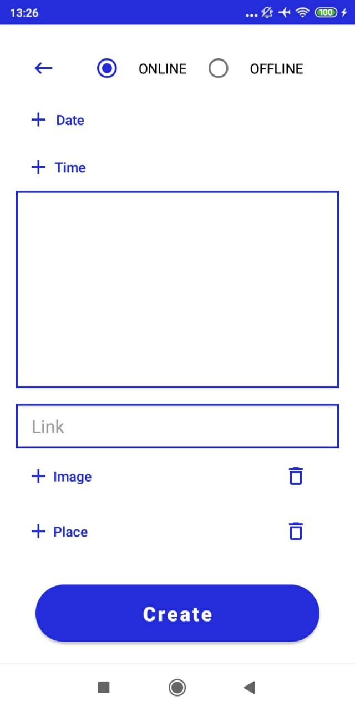

## Дипломное задание (Профессия Android Developer)

**Реализованы функции:**
- регистрация/аутентификация

- CRUD для следующих типов сущностей: посты, события, работы

      

- отображение ленты постов и ленты событий

      

- пост и событие могут включать картинки, аудио, видео и ссылки
- «проигрывание» медиа-вложений
- пост и событие могут включать геометку
- отображение геометки на карте по клику
- 
  

- переход по внешним ссылкам
- отображение стены автора с информацией о работах

            

